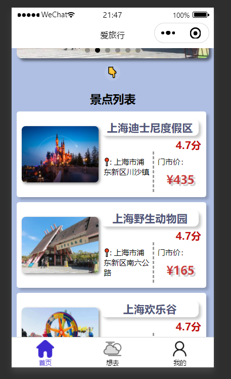
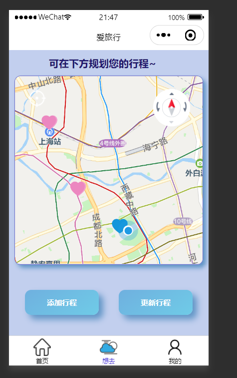
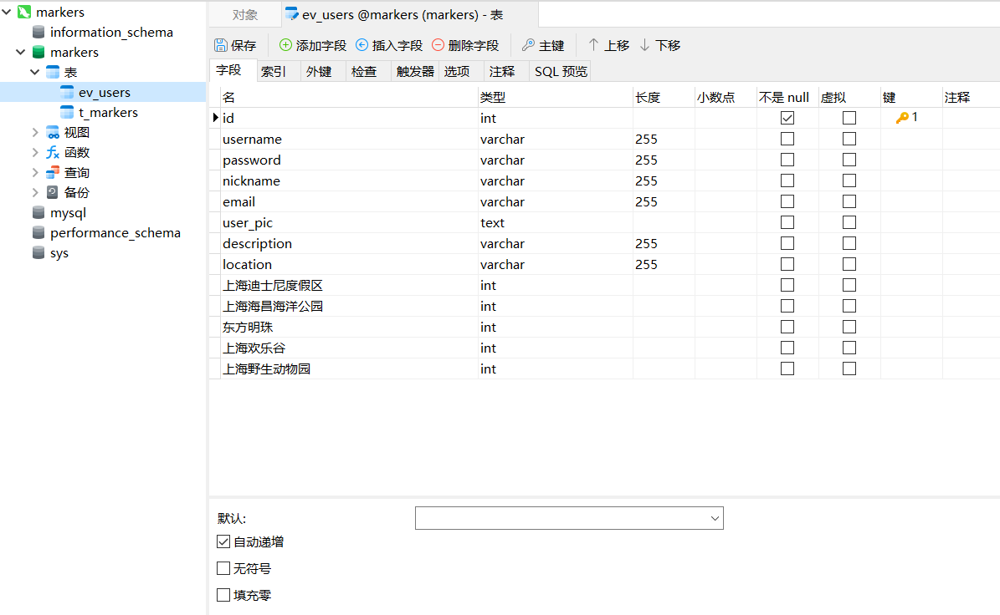
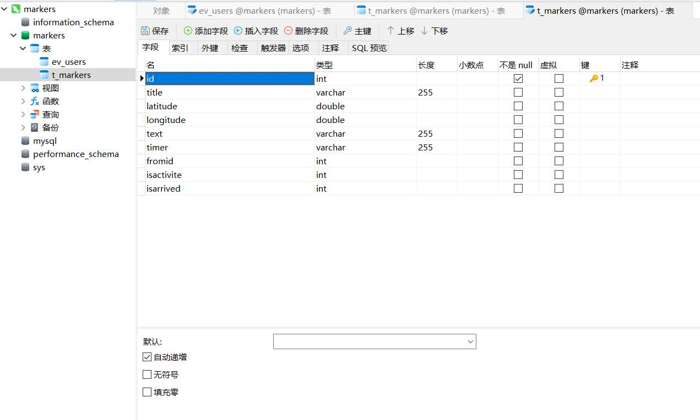

# 基于 微信小程序 & NodeJS 的行程记录demo

&emsp;&emsp;该项目为上海大学通信学院与携程旅行网于2022年3月联合开设的的前端训练营的结营大作业。该项目使用微信开发者工具完成了一个简单的行程记录和旅行规划小程序，并拥有完整的注册登录系统。每个用户所对应的账号可以通过标记注册多个地点用来规划行程，也可以给去过的地方添加行程日记。每个地点可以对应上传图片并分享给微信好友。对每个地点都有相应的增删查改操作。还有简单的景点买票服务，也可对订单进行修改。后端使用nodejs搭配mysql实现，可将数据上传至数据库中保存。
 <br />

<p align="center">

  <h2 align="center"> Enjoy your trip !</h2>

</p>

## 演示
<div display="flex">
 
 
  
  
</div>

## 目录

- [上手指南](#上手指南)
  - [开发前的配置要求](#开发前的配置要求)
  - [安装步骤](#安装步骤)


###### 开发前的配置要求

1. 安装MySQL数据库
2. 安装nodejs框架
3. 安装微信开发者工具

###### **安装步骤**

1. Clone the project

```sh
git clone git@github.com:Qpicpicxxz/Trip-ticketMiniProgram.git
```
2. 配置您的数据库如下两表

 
  
  
3.在nodeServer/db/index.js文件中配置您的数据库信息，便可在nodeServer文件下开启终端（用管理员身份打开），输入

```sh
node app.js
```
开启服务器，别忘了在终端中先输入

```sh
net start MySQL80
```
启动数据库，否则会报错

4.使用微信开发者工具导入triprecorder项目，即可使用。

 ### 鸣谢 
 
   <a href="https://github.com/wangyouOVO">@忘忧OVOIII </a>
  
